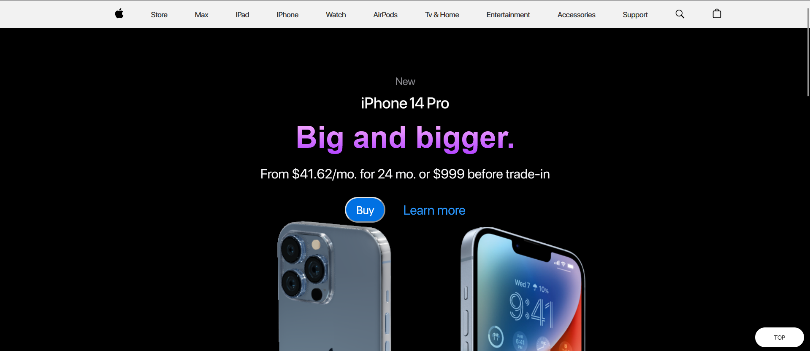

  <h1 >📱 3D iPhone Website using Three.js</h1>

 

  

## Description

This is a 3D iPhone website created using Three.js, a JavaScript 3D library. The website features a 3D model of an iPhone, which the user can interact with and explore.

## Getting Started

To view the website, simply open the `index.html` file in your web browser. There is no need to install any additional software or libraries.

## Usage

Once the website has loaded, you can interact with the iPhone model in several ways:

- Click and drag the mouse to rotate the model.
- Use the mouse scroll wheel to zoom in and out.
- Click on the buttons at the bottom of the screen to switch between different screens on the iPhone.

## Contributing

Contributions to this project are welcome. Please open an issue or pull request if you find a bug or have a suggestion for improvement.

## Credits

This project was created by [Mornieur](https://github.com/Mornieur).

The iPhone 3D model used in this project was created by [Pirmin Huber](https://www.pirminhuber.ch/3d-iphone-model/).
